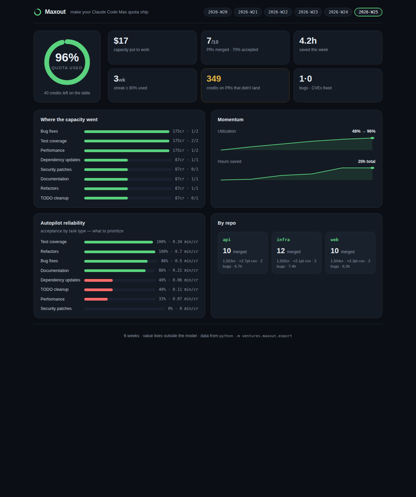

# Maxout — finish your Claude Code Max quota every week (on real work)

> You pay for a big weekly Claude Code Max quota and leave half of it on the table.
> Maxout points that idle capacity at **your own repos** — bugs, tests, deps, CVEs,
> docs, TODOs — opens PRs you review Monday morning, and reports exactly what your
> quota bought you.

It's your overnight loop, aimed at *your real backlog* instead of a museum, and
instrumented so "I burned my quota" becomes "here's the value I got."



## The analytics (the part you asked about)
Maxout turns a log of autopilot runs into five families of metric. **Bold = live in
the demo right now**; the rest are natural next additions on the same data.

**1. Quota / utilization** — *am I actually using what I pay for?*
- **% of weekly quota used · credits left on the table**
- **$-equivalent of capacity put to work** (vs API rates)
- **utilization trend across weeks · weekly streak ≥ target**
- **"wasted" credits** — spent on PRs that didn't merge or runs that failed
- time-of-week idleness (when your capacity sits unused)

**2. Output / value shipped** — *what did it produce?*
- **PRs opened vs merged · acceptance rate**
- **bugs fixed · coverage Δ · deps updated · CVEs patched · docs · TODOs cleared**
- **lines / files changed · estimated hours saved**

**3. Autopilot reliability** — *where can I trust it?* (drives prioritization)
- **acceptance rate per task type** (e.g. tests 100%, security patches 0%)
- **ROI: minutes saved per credit, per type**
- rework rate (changes-requested) · failure rate

**4. Codebase health** — *is the code getting better?*
- **coverage trend · per-repo breakdown**
- open bug / TODO burndown · dependency freshness · open-vuln count
- tech-debt hotspots (files that keep needing fixes) · per-repo health score

**5. Cost / ROI & momentum**
- $-value delivered vs your subscription cost ("your $200/mo Max returned ~$X")
- **week-over-week deltas · multi-week streak** · backlog size & burndown

## Run it
```bash
python -m ventures.maxout                 # built-in 6-week sample
python -m ventures.maxout runs.json       # your own logged runs
python -m unittest ventures.maxout.tests.test_analytics -v   # 10 tests
```

## Dashboard (UI)
A static, dependency-free dashboard (dark theme, inline-SVG charts) that reads the
generated `data.json` — deployable on Vercel, viewable offline.

```bash
python -m ventures.maxout.export                       # writes ui/data.json
cd ventures/maxout/ui && python -m http.server 8099    # open http://localhost:8099
```
Quota donut, capacity-by-kind bars, utilization/hours sparklines, a color-coded
reliability table (green = trust it, red = stop wasting quota on it), and per-repo
cards — with a week selector across the top.

## Sample output (terminal)
```
             MAXOUT · weekly Claude Code Max report
================================================================
  Week 2026-W25

  QUOTA USED:  96%   (960/1000 credits · 40 left on the table)
     ~$17 of capacity put to work · 3-week streak ≥80% · 349cr on PRs that didn't land

  SHIPPED:  7 of 10 PRs merged (70% accepted) · ~4h saved
     1 bugs · +2.4pt coverage · 4 deps · 0 CVEs · 3 docs · 0 TODOs

  Momentum
    Utilization   ▁▂▄▆▇█   48% → 96%
    Hours saved   ▁▁▃▄██   20h over 6 weeks

  Autopilot reliability (acceptance by task type)
    Test coverage      100% accepted · 0.3 min saved/credit
    Refactors          100% accepted · 0.7 min saved/credit
    ...
    Security patches     0% accepted · 0.0 min saved/credit
```
The under-use → maxed-out story (48% → 96%) is exactly the pain you described.

## What's real vs. what plugs in
- **Real today:** the analytics engine + report, fully tested, offline.
- **Plugs in (`runner.py`):** the live `ClaudeCodeRunner` that scans a repo for work,
  drives `claude -p` headless on a worktree to implement + test each item, opens a PR,
  records a Task, and **stops when the weekly credit budget is hit — so you finish it
  every week.** Kept as an interface on purpose: the value to see today is the
  engine + analytics; the live wiring is one module.

## Two layers (they stack)
1. **Personal tool (now):** scratches your own itch, uses your one edge (build capacity),
   zero competitive risk.
2. **Product (maybe):** the "I under-use my AI subscription" pain generalizes. Fresh
   angle — *most background-agent tools bill you for their compute; Maxout runs on the
   quota you already bought.* Needs a proper crowd-check before calling it a product
   (background agents are a hot space) — but the personal tool is useful regardless.

## Layout
```
model.py       Task model + constants (credits, kinds, statuses)
analytics.py   utilization / value / by_kind / agent_performance / per_repo / trend / streak
sample_data.py deterministic 6-week run log (under-use -> maxed-out)
report.py      the weekly report you read Monday
runner.py      orchestration contract + SimulatedRunner (live runner plugs in here)
__main__.py    CLI (sample or your runs.json)
tests/         10 unittest cases
```
